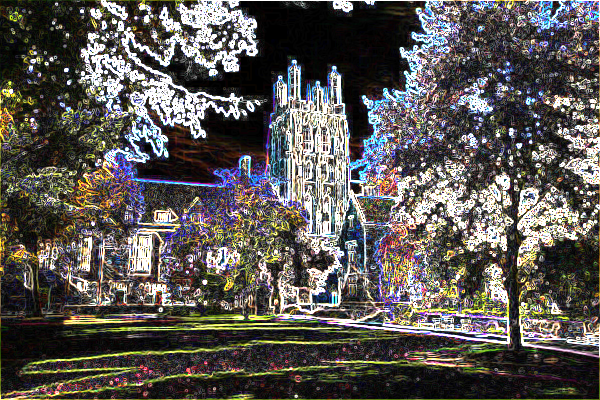

# BMP filter

You can apply picture filters such as edge detection on bmp files. The program creates the filteres copy of the image.
You can find some examples in ./images folder.

## Usage

After compilation you can run the following command in terminal: 

```console
$ ./filter -<flag> <./path/source.bmp> <./path/filtered.bmp>
```

For example:

```console
$ ./filter -e ./images/courtyard.bmp filtered.bmp
```

Original image:


The image after applying edge detection filter:



You can use the following flags to apply differen filters:

- g => to get black and white pictures (grayscale)
- s => to apply the sepia effect
- r => to reflect the image horizontally
- b => to make the original picture a bit blury
- e => to detect and highlight edges

### Notes

- blur filter based on the average RGB value of the surrounding pixels using 3x3 matrix
- edge detection based on the Sobel operator

You can read about the Sobel operator by clickin [here.](https://en.wikipedia.org/wiki/Sobel_operator)
